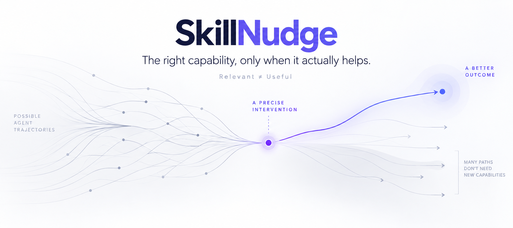

<div align="center">
  <p>
    <a href="README.md">English</a>
    ·
    <a href="README.zh-CN.md">简体中文</a>
  </p>
  <p>
    <a href="#quick-start">Quick Start</a>
    ·
    <a href="#why-skillnudge">Why SkillNudge</a>
    ·
    <a href="#north-star">North Star</a>
    ·
    <a href="#docs">Docs</a>
  </p>
  <p>
    <a href="https://github.com/kaiykk/skillnudge/blob/main/LICENSE">
      
    </a>
    <a href="https://github.com/kaiykk/skillnudge/stargazers">
      
    </a>
    <a href="https://github.com/kaiykk/skillnudge/commits/main">
      
    </a>
  </p>
</div>

<!-- Official Week 1 hero image. -->
<p align="center">
  
</p>

SkillNudge is a local-first capability intervention advisor for AI agents.

It helps answer a question that Skill search alone cannot:

> **What capability is actually missing now — and is adding any intervention
> worth it at all?**

## Why SkillNudge?

### Relevant ≠ Useful

Search can tell you what looks related.

SkillNudge asks a harder question:

> **Will adding this capability actually improve the next trajectory?**

- A relevant Skill may be unnecessary for a stronger model.
- The same capability may help at one task stage and hurt at another.
- The right intervention may be a Plugin, Tool, or resource rather than a Skill.
- Sometimes no intervention is the best answer.

Read the [product thesis](docs/product-thesis.md) for the deeper framing.

## What It Does

### 01 — Understand

Find the capability gap behind a vague request or a blocked task.

### 02 — Discover

Search for the smallest plausible intervention instead of adding more
capability by default.

### 03 — Judge

Separate semantic relevance from expected gain, trust, friction, and stage fit.

### 04 — Advise

Return zero to two bounded recommendations, or explicitly recommend nothing.

These are the target V0 capabilities. The current repository already contains
the planning, local retrieval, evidence hydration, and Candidate Judgement /
Final Advice runtime surfaces; the Week 1 provider-backed final-stage
validation is complete.

## Quick Start

### Development Preview

The repository currently exposes a direct Python development workflow, not a
packaged end-user CLI.

```bash
git clone https://github.com/kaiykk/skillnudge.git
cd skillnudge
PYTHONPATH=src python3 -m unittest discover -s tests -p 'test_*.py' -v
```

To run the current local retrieval smoke path, provide a compatible Skill
corpus:

```bash
PYTHONPATH=src python3 scripts/run_d001.py \
  --corpus /path/to/corpus.json \
  --run-dir runs/d001-checkpoint1
```

The run writes reviewable artifacts under `runs/`. It is an engineering smoke
path, not a recommendation-quality benchmark.

Live planning and judgement runs require an explicitly configured
OpenAI-compatible provider. See
[`docs/provider-configuration.md`](docs/provider-configuration.md) for the
local-only configuration path. Never commit or paste provider credentials.

## Example Use Case

> “I want to build a good frontend/UI prototype, but I do not understand
> design and do not know how to describe what I want.”

At the current implementation level, the D001 flow is:

```text
Capability gap
  -> design framing and UI decision support
Intervention
  -> Skill
Discovery
  -> candidate capabilities
Evidence
  -> candidate body + retrieval evidence + explicit provenance gaps
Judge
  -> implemented runtime surface; Week 1 provider-backed validation complete
```

No recommendation is fabricated here. D001 is a bounded design probe, not a
hard-coded answer. See [`docs/golden-cases.md`](docs/golden-cases.md).

## Product Principles

> **The smallest useful intervention wins.**

> **No intervention is a valid outcome.**

> **Evidence before recommendation.**

## North Star

SkillNudge is starting as a capability intervention advisor.

Longer term, the project is organized around three layers:

```text
Capability Control Plane
  -> Eval / Utility Layer
  -> Capability Evolution Loop
```

The long-term question is not only “What Skill should I use?” It is also:

> **Does this capability still help this model, in this harness, on this task?**

Read the full [North Star](docs/north-star.md). The long-term direction does
not imply that evaluation or capability evolution is implemented today.

## Current Status

### Working today

- Capability Framing
- Intervention Planning
- Query Planning
- Local SQLite FTS5 / BM25 retrieval
- Evidence Hydration
- Observable runtime traces
- Candidate Judgement and minimal Final Advice runtime code

### In progress

- Provider-backed validation of Candidate Judgement and Final Advice
- Completion review for the current Week 1 advisor loop

### Not yet

- Packaged production CLI
- Automatic installation
- Utility evaluation and Skill Utility Drift detection
- Capability evolution
- Review, Grow, and Watch

The repository is an early implementation baseline, not a complete product or
a product-quality benchmark.

## Docs

Four entry points cover the main project context:

- [North Star](docs/north-star.md)
- [Architecture & Runtime](docs/architecture.md)
- [Contracts](docs/contracts/README.md)
- [Research](docs/research/README.md)

[Browse all documentation](docs/).

## Roadmap

### Now

Capability intervention:

```text
understand -> discover -> judge -> advise
```

### Next

Measure whether interventions actually improve downstream trajectories.

### Later

Detect Skill Utility Drift and evaluate whether to evolve, compress, replace,
or retire capabilities.

These are directional stages, not completed features.

## Contributing

SkillNudge is an early open-source project. Before opening a change, read the
current documentation and keep implemented behavior separate from proposed
behavior.

Good contributions are narrow, falsifiable, evidence-aware, and compatible
with the local-first Week 1 boundary.

For local validation:

```bash
PYTHONPATH=src python3 -m unittest discover -s tests -p 'test_*.py' -v
python3 -m compileall -q src scripts
git diff --check
./scripts/check_publish_gate.sh
```

## License

SkillNudge is released under the [MIT License](LICENSE).
