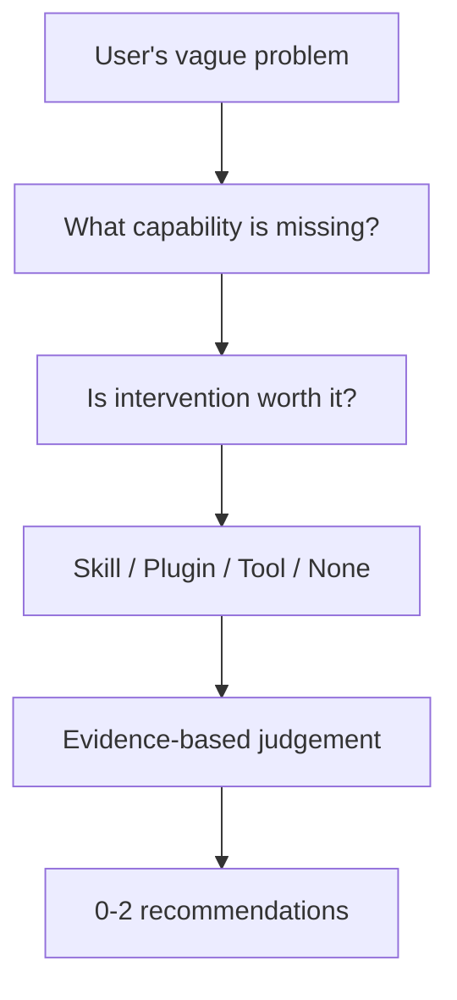

# SkillNudge

**The right capability, only when it helps.**

SkillNudge is an open-source, local-first capability intervention advisor for
AI coding agents. This repository is a docs-first product baseline with a
working Checkpoint 1 retrieval smoke path; it is not yet a complete product.

It is being designed around a question that is slightly different from
“Which Skills should I install?”:

> What capability is actually missing at this point in the task, and is any
> intervention worth adding at all?

SkillNudge may eventually consider:

- Agent Skills
- Plugins
- external tools
- companion resources
- or no intervention

The current [FROZEN] product boundary is **Advise**: understand the blockage,
plan the smallest useful intervention, inspect evidence, and explain a bounded
recommendation. Review, Grow, and Watch are future capabilities.

The long-term research direction is documented separately in the
[North Star](docs/north-star.md). It is not a claim that the current Week 1
implementation already provides an eval-driven capability lifecycle.

## Why SkillNudge?

The Agent Skill ecosystem is growing quickly, but discovery is not the whole
problem:

- users often cannot name the capability they need;
- the same intervention can have different value at different task stages;
- semantic relevance does not mean that an intervention is useful now;
- too many instructions can add context load, trigger mistakes, or overconstrain
  a capable model;
- a stronger model may already provide what an older Skill used to add;
- the right intervention may be a Plugin or Tool rather than a Skill;
- doing nothing can be the best answer.

The core product thesis is:

> **Skill utility is contextual, not static.**

As a concept:

```text
Utility = f(
  intervention,
  task,
  task_stage,
  model,
  project_context,
  time
)
```

This is a design model, not a V0 scoring formula.

## Product Principle

SkillNudge is not intended to maximize installation count or produce a Top-10
list. Its guiding rule is:

> **Find the smallest intervention that meaningfully improves the next
> trajectory.**

The intended advice discipline is:

- zero recommendations is valid;
- ideally one primary recommendation;
- at most a primary plus a supporting item;
- companion resources are shown separately;
- rejected alternatives can be explained when that helps;
- no recommendation spam.

## Main Loop



The initial intervention model includes Skill, Plugin, Tool, Companion Resource,
and No intervention. The model remains deliberately open because the best
answer may not be a Skill.

## V0 Design Baseline

The frozen V0 runtime map is:

```text
Raw User Request
        │
        ▼
1. Intake / Context
        │
        ▼
2. Capability Framing
        │
        ▼
3. Intervention Planning
        │
        ▼
4. Query Planning
        │
        ▼
5. Candidate Acquisition
        ├── Local Retrieval
        └── Conditional Live Discovery
        │
        ▼
6. Evidence Hydration
        │
        ▼
7. Candidate Judgement
        │
        ▼
8. Final Advice

Trace crosses the entire runtime.
```

The design baseline is documented in:

- [`docs/runtime.md`](docs/runtime.md)
- [`docs/candidate-acquisition.md`](docs/candidate-acquisition.md)
- [`docs/retrieval.md`](docs/retrieval.md)
- [`docs/trace.md`](docs/trace.md)

## Local-First, Lightweight by Default

V0 is designed to run on an ordinary developer laptop:

- no mandatory embedding model;
- no vector database requirement;
- no GPU requirement;
- local SQLite with FTS5 / BM25 as the default retrieval direction;
- live discovery only when local evidence or coverage is insufficient;
- full candidate bodies are hydrated only for a small candidate pool.

GitHub is intended primarily for known-candidate source retrieval, provenance,
and freshness checks. It is not assumed to be a complete index of the Skill
universe.

## Design Cases

The first three cases are deliberately different:

- **D001 — UI Vocabulary Gap:** the user needs design and prototyping guidance
  but does not know the professional vocabulary.
- **D002 — Premature Execution / Thinking Partner:** the best intervention may
  be a collaboration mode, Plugin, Tool, or model bridge rather than a Skill.
- **D003 — No Intervention:** a straightforward question may need no additional
  capability.

See [`docs/golden-cases.md`](docs/golden-cases.md). These cases are design
probes, not hardcoded answers.

## Current Status

**[CHECKPOINT 1] Local retrieval baseline.**

This repository currently contains:

- product and runtime design documents;
- decision records;
- golden cases;
- a SQLite/FTS5/BM25/RRF candidate-acquisition baseline;
- a frozen D001 query fixture and engineering smoke tests.

It does **not** currently claim to provide:

- a working `skillnudge advise` command;
- CapabilityPlanner, InterventionPlan runtime, or LLM QueryPlanner;
- an embedding or reranking backend;
- Evidence Hydration, Candidate Judge, or Final Advice;
- automatic installation;
- Review, Grow, or Watch;
- automatic Skill Utility Drift detection;
- a benchmark result or superiority claim.

Run Checkpoint 1 with a local corpus using:

```bash
PYTHONPATH=src python3 scripts/run_d001.py \
  --corpus /path/to/corpus.json \
  --run-dir runs/d001-checkpoint1
```

The run creates reviewable artifacts under `runs/` and does not create a
recommendation.

## Roadmap

The intended direction is deliberately staged:

1. **V0:** Discovery / Intervention Advisor.
2. **V0.5:** retrieval quality and corpus freshness.
3. **V1:** optional semantic or hybrid retrieval.
4. **Later:** Review, Grow, and Watch.
5. **Future:** Skill Utility Drift, including simplify, update, replace, and
   retire decisions.

These are roadmap directions, not completed capabilities.

## Design Documents

- [`docs/product-thesis.md`](docs/product-thesis.md) — core product thesis and
  state labels.
- [`docs/product-evolution.md`](docs/product-evolution.md) — why the product
  moved beyond Skill Search.
- [`docs/architecture.md`](docs/architecture.md) — product and V0 system maps.
- [`docs/capability-map.md`](docs/capability-map.md) — Advise, Review, Grow,
  and Watch.
- [`docs/runtime.md`](docs/runtime.md) — V0 runtime map and layer contracts.
- [`docs/feature-framework.md`](docs/feature-framework.md) — responsibility
  matrix for planned and future modules.
- [`docs/candidate-acquisition.md`](docs/candidate-acquisition.md) — local
  sources, live fallback, normalization, and cache levels.
- [`docs/data-layer.md`](docs/data-layer.md) — candidate lifecycle and
  provenance boundaries.
- [`docs/retrieval.md`](docs/retrieval.md) — lightweight retrieval baseline.
- [`docs/judge.md`](docs/judge.md) — intervention utility judgement target.
- [`docs/trace.md`](docs/trace.md) — observable run artifacts without private
  chain-of-thought.
- [`docs/golden-cases.md`](docs/golden-cases.md) — D001, D002, and D003.
- [`docs/skill-utility-drift.md`](docs/skill-utility-drift.md) — future
  model-aware lifecycle direction.
- [`docs/north-star.md`](docs/north-star.md) — canonical long-term product and
  research thesis.
- [`docs/research/north-star-references.md`](docs/research/north-star-references.md)
  — verified external bibliography for the North Star.
- [`docs/research/`](docs/research/) — historical evidence and research
  boundaries.
- [`docs/open-questions.md`](docs/open-questions.md) — unresolved design
  questions that must not be silently frozen.
- [`docs/roadmap.md`](docs/roadmap.md) — staged scope and utility drift.
- [`docs/week1.md`](docs/week1.md) — proposed first implementation boundary.
- [`docs/decisions/`](docs/decisions/) — historical decision records.

## Contributing

The project is in an early design stage. Before proposing implementation,
please read the design documents and keep these distinctions explicit:

- design target versus implemented behavior;
- evidence versus hypothesis;
- Skill versus Plugin, Tool, Companion Resource, or No intervention;
- retrieval relevance versus intervention utility.

Small, falsifiable proposals are preferred to broad platform additions.

## License

SkillNudge is released under the [MIT License](LICENSE).
