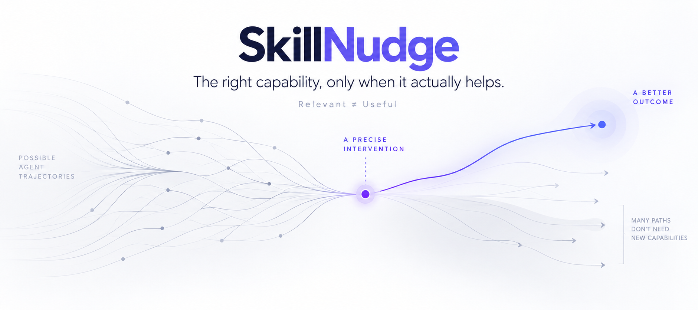

<div align="center">
  <p>
    <a href="README.md">English</a>
    ·
    <a href="README.zh-CN.md">简体中文</a>
  </p>
  <p>
    <a href="#快速开始">快速开始</a>
    ·
    <a href="#为什么是-skillnudge">为什么是 SkillNudge</a>
    ·
    <a href="#north-star">North Star</a>
    ·
    <a href="#文档">文档</a>
  </p>
  <p>
    <a href="https://github.com/kaiykk/skillnudge/blob/main/LICENSE">
      
    </a>
    <a href="https://github.com/kaiykk/skillnudge/stargazers">
      
    </a>
    <a href="https://github.com/kaiykk/skillnudge/commits/main">
      
    </a>
  </p>
</div>

<!-- SkillNudge 官方 Hero 图片。 -->
<p align="center">
  
</p>

SkillNudge 是一个面向 AI Agent 的本地优先、证据驱动能力生命周期。

它试图回答一个仅靠 Skill 搜索无法回答的问题：

> **当前真正缺少什么能力？现在增加任何介入，究竟是否值得？**

## 为什么是 SkillNudge？

### Relevant ≠ Useful

搜索可以告诉你哪些东西看起来相关。

SkillNudge 进一步追问：

> **增加这个能力，真的会改善下一段任务轨迹吗？**

- 对更强的模型来说，一个相关 Skill 可能已经没有必要。
- 同一种能力在不同任务阶段，可能有帮助，也可能造成负担。
- 合适的介入可能是 Plugin、Tool 或 Resource，而不是 Skill。
- 有时候最好的答案就是不介入。

更完整的背景见[产品命题](docs/product-thesis.md)。

## 它做什么？

### 01 — Understand

从模糊请求或任务阻塞中识别能力缺口。

### 02 — Discover

寻找最小的可行介入，而不是默认增加更多能力。

### 03 — Judge

把语义相关性与预期收益、信任、摩擦和阶段适配度分开判断。

### 04 — Advise

返回 0–2 个有边界的建议，也可以明确建议不介入。

这些是 V0 的目标能力。当前仓库已经包含 planning、本地检索、Evidence
Hydration、Candidate Judgement / Final Advice 运行时，以及组合后的开发态
`advise` CLI。Phase 1 已在当前 bounded product 边界内完成发布就绪验证。

## 快速开始

### 为 Codex 安装

```bash
git clone https://github.com/kaiykk/skillnudge.git
cd skillnudge
./scripts/install_codex.sh
export PATH="$HOME/.local/bin:$PATH"
```

安装脚本会创建 `skillnudge` 命令，构建随包提供的 Phase 1 corpus 和
SQLite/FTS5 index，并把显式 Codex Skill 安装到
`$HOME/.agents/skills/skillnudge`。

在 Codex 中打开任意无关仓库，然后调用：

```text
$skillnudge
```

这个 Skill 会把当前请求交给已安装的 Phase 1 runtime。结果可以是推荐、
澄清、source error、insufficient evidence，或者：
`No additional capability appears necessary now.` 默认 index 位于当前仓库
之外，并由 installer bootstrap 的版本元数据管理。

已安装 CLI 提供以下有限入口：

```bash
skillnudge --help
skillnudge bootstrap
skillnudge advise "我想做一个更好的 UI 原型，但不知道怎样描述自己的需求"
skillnudge review --stdin
skillnudge validate --stdin
skillnudge evolve --stdin
skillnudge need create --stdin
skillnudge watch --stdin
```

`review --stdin` 是 provider-free 的 Native Review MVP。在任意无关工作目录中，
宿主 Agent 可以提交一条真实或脱敏的、可观察的执行记录，得到
`TEST`、`WATCH`、`NO_INTERVENTION` 或 `INSUFFICIENT`，同时保留事件引用和明确的不确定性。
Review 不推断隐藏的 skill 消费，也不宣称介入已经有效。

`validate --stdin` 接收一个 `TEST` 结果和冻结的 Validation Envelope，在同一个有边界的
任务上比较没有/有精确 instruction intervention 的两臂执行，返回 `HELPS`、`NEUTRAL`、
`HURTS`、`INCONCLUSIVE` 或 `NOT_EVALUATED`，同时保留 `pair_status`。结果只适用于当前任务、
宿主、模型和 intervention，不会自动推广或改写 Skill。

`evolve --stdin` 接受满足 Admission Contract 的 `TEST` Review 结果和宿主提出的
instruction candidate。之前的 `INTERVENTION_ABLATION` 证据可以加强 admission，
但不是必需条件。EVOLVE 只生成一个非活动的版本化 `CANDIDATE`，不会执行
Validate、安装、激活、晋升或修改当前 capability。EVOLVE 之后的 `VALIDATE`
通过 `validate --stdin` 的 `CAPABILITY_REVISION` 模式执行，生命周期决定仍由
Human 负责。

`need create --stdin` 会在源码目录之外持久化一条有边界的未解决 Evidence
Need。`watch --stdin` 会在后续进程重新加载它，把持久化的
`unresolved_question` 和 `interesting_future_event` 原样提供给 Host，再针对
一条宿主观察到的 experience 返回 `IGNORE`、`WAKE` 或 `INSUFFICIENT`。
当结果为 `WAKE` 时，结果中还会包含并持久化最小的
`reactivation_context`，带上挂起的问题、原始 evidence refs 和新的 wake
evidence refs，供后续 Host 进程执行一次有边界的 continuation step。Core
会拒绝被修改的条件上下文，但不在确定性逻辑中做语义文本匹配。WATCH
不需要 provider、保持 Need 为 OPEN，不会宣称 utility、晋升 candidate，也不会推进生命周期。详见
[`docs/autonomous-evolution-baseline-v0.md`](docs/autonomous-evolution-baseline-v0.md)。

Phase 1 的 planning 和 judgement 需要通过 `SKILLNUDGE_MODEL_*` 环境变量配置
OpenAI-compatible provider。请参阅
[`docs/provider-configuration.md`](docs/provider-configuration.md) 了解 provider
边界。不要提交或粘贴 provider 凭据。

### 开发态测试

```bash
PYTHONPATH=src python3 -m unittest discover -s tests -p 'test_*.py' -v
```

仓库也提供 clean-install 检查：

```bash
./scripts/smoke_install_codex.sh
```

## 示例场景

> “我想做一个更好的 frontend/UI 原型，但我不懂设计，也不知道该怎样描述
> 自己想要什么。”

在当前实现层面，D001 的流程是：

```text
能力缺口
  -> 设计 framing 与 UI 决策支持
介入面
  -> Skill
候选发现
  -> 能力候选
证据
  -> 候选正文 + 检索证据 + 明确的 provenance 缺口
Judge
  -> bounded provider-free Native Review / Validate 产品面
```

这里不会虚构某个推荐结果。D001 是有边界的设计探针，不是写死的答案。详见
[`docs/golden-cases.md`](docs/golden-cases.md)。

## 产品原则

> **最小的有效介入优先。**

> **不介入也是合法结果。**

> **先有证据，再给建议。**

## North Star

SkillNudge 是一个证据驱动的能力生命周期：

```text
ADVISE -> REVIEW -> EVOLVE -> VALIDATE -> DECIDE
       WATCH（横切观察）
```

如果 Review 证据仍需加强，可以在 EVOLVE 之前可选执行
`VALIDATE / INTERVENTION_ABLATION`；`HELPS` 不是强制门槛。

当前已经发布的 bounded slice 包含 REVIEW、VALIDATE 和 candidate-only EVOLVE。
完整方向与用户体验含义见 [North Star](docs/north-star.md) 和
[North Star Experience Reference](docs/north-star-experience.md)。

## 当前状态

**截至 2026-10-06 的产品状态：** provider-free Native Review MVP 已成为当前已发布的
产品结果，同时保留 Phase 1 Native advisor 作为运行时基线。在任意无关工作目录中，
宿主 Agent 都可以把一条可观察 experience 交给 `skillnudge review --stdin`，得到带事件引用的
有限 disposition。Phase 3/4 研究仍是产品契约的历史输入，没有建立可复用的 capability gap
或 Skill defect。详见 [`docs/current-status.md`](docs/current-status.md) 和
[`docs/product-delivery-sync.md`](docs/product-delivery-sync.md)。

### 当前可用

- Capability Framing
- Intervention Planning
- Query Planning
- 本地 SQLite FTS5 / BM25 检索
- Evidence Hydration
- 可观察的 Runtime Trace
- provider-free Native Review（单条可观察 Agent experience）
- provider-free Native Validate（单条 bounded TEST candidate）
- provider-free Native EVOLVE（只创建 candidate，不自动晋升）
- 组合后的 Phase 1 `advise` 开发态 CLI，支持有边界的早停与 resume
- Candidate Judgement 与最小 Final Advice 运行时代码

### Phase 1 状态

- Phase 1 D001 / D002 / D003 发布就绪验证已完成

### 研究阶段状态

- Phase 2 measurement 仍然只适用于已测试条件，没有建立普遍性的 utility 结论
- Phase 3 当前有边界的 evidence diagnosis campaign 已完成；
  `reusable_capability_gap=INSUFFICIENT`
- Phase 4A entry hardening 是历史输入；产品已具备 bounded candidate-only EVOLVE

第一轮有边界的 utility evidence 得到一个机械上有效的 sibling 比较（`H2`），
另一个 held-out Oracle 无效；但 sibling 两臂不是新的 Native Host/model 轨迹，
所以本轮对 candidate utility 是 `NOT_EVALUATED`，不是通用 utility 或 promotion
结论；完整 packet 保留在 Home Project。

### 尚未发布

- Utility 评估与 Skill Utility Drift 检测
- 能力演化
- 多 experience 聚合与 Capability Gap Registry
- 自动晋升、多 experience 聚合、Capability Gap Registry 与 Watch
- Phase 4A runtime、Variant promotion 或 Darwin/SkillOpt evolution

当前仓库是早期实现基线，还不是完整产品，也不是产品质量 benchmark。

## 文档

四个入口覆盖主要项目背景：

- [North Star](docs/north-star.md)
- [North Star Experience Reference](docs/north-star-experience.md)
- [Architecture & Runtime](docs/architecture.md)
- [Contracts](docs/contracts/README.md)
- [Research](docs/research/README.md)

[浏览全部文档](docs/)。

## Roadmap

### Now

```text
ADVISE -> REVIEW -> EVOLVE -> VALIDATE -> DECIDE
```

当前 bounded Native Review 和 candidate-only EVOLVE MVP 已发布。EVOLVE
之后的 `CAPABILITY_REVISION` Validate 仍只适用于对应的 tested pair，DECIDE
仍由 Human 负责。

### Next

在新的可观察 Native Host experience 上运行 direct Review -> EVOLVE 路径，
并记录 bounded 的 EVOLVE 后 Validate decision evidence。

### Later

支持更广泛的 experience 聚合、utility-drift observation 和未来的 evolution
operator；promote、rollback、retire 仍由 Human 负责，不自动执行。

## 参与贡献

SkillNudge 仍处于早期开源阶段。提交变更前，请先阅读当前文档，并明确区分已实现
行为和提议行为。

欢迎范围窄、可以证伪、尊重证据与不确定性，并且符合当前 bounded product
边界的贡献。

本地验证：

```bash
PYTHONPATH=src python3 -m unittest discover -s tests -p 'test_*.py' -v
python3 -m compileall -q src scripts
git diff --check
./scripts/check_publish_gate.sh
```

## 许可证

SkillNudge 使用 [MIT License](LICENSE) 发布。
