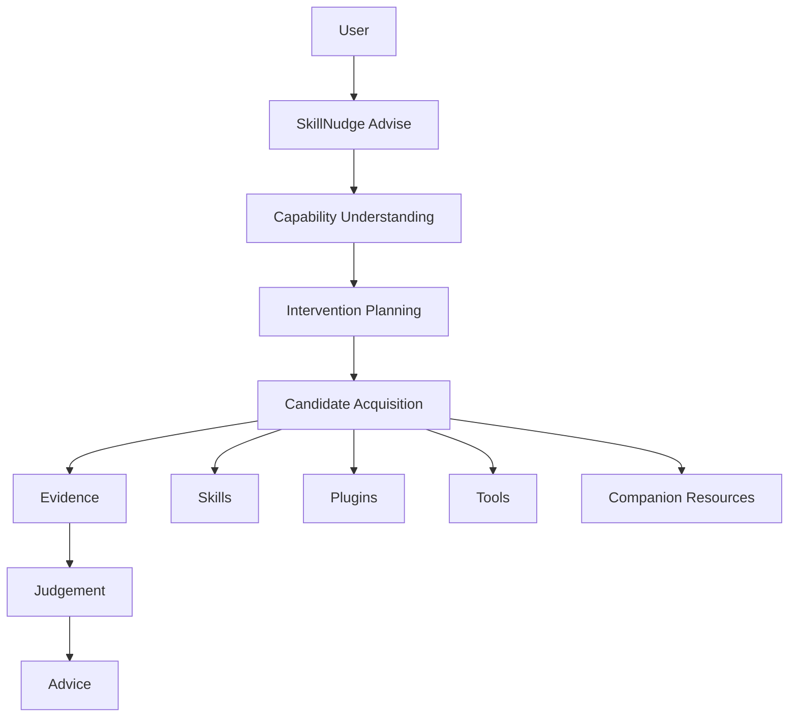
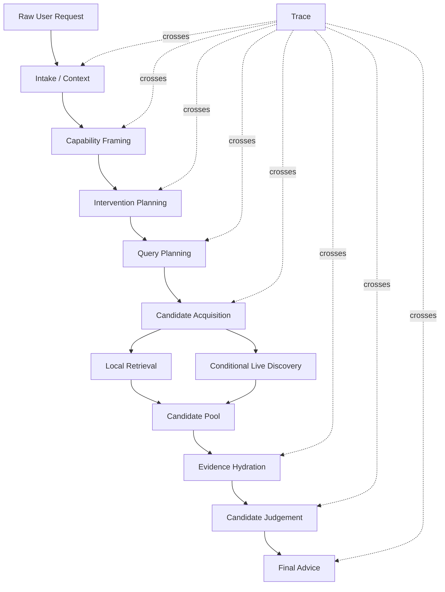
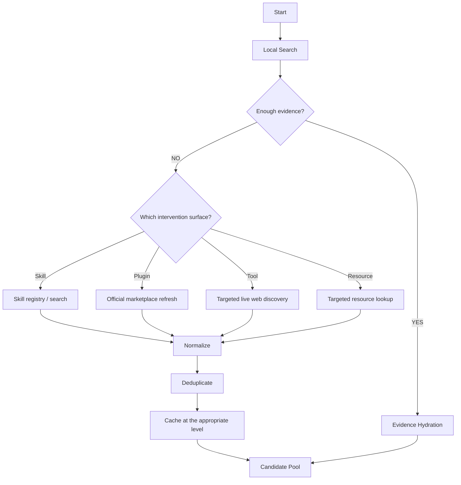

# Architecture

## Status

- `[FROZEN]` V0 is a layered, trace-first Intervention Advisor.
- `[FROZEN]` Local retrieval and conditional live discovery converge into a
  Candidate Pool before evidence hydration and judgement.
- `[WORKING HYPOTHESIS]` These boundaries are sufficient for a lightweight
  first implementation.
- `[FUTURE]` Semantic retrieval, large-scale source adapters, and lifecycle
  automation.

The diagrams describe design boundaries, not implemented services. SkillNudge
does not require a microservice architecture.

## Product-Level Architecture

## V0 Runtime

## Candidate Acquisition Decision Tree

## Boundary Notes

- Capability Framing happens before candidate search.
- Candidate Acquisition constructs a pool; it does not give final advice.
- Evidence Hydration turns shallow search results into judgeable evidence.
- Candidate Judgement estimates intervention utility, not just text similarity.
- Final Advice is intentionally small and can be `no_intervention`.
- Trace artifacts are explicit and reviewable; private chain-of-thought is not
  part of the design.
