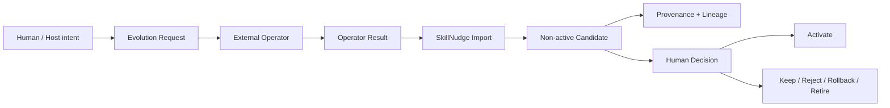

# SkillNudge Architecture

SkillNudge is a control plane around external Skill evolution operators. The
runtime owns identity, lineage, lifecycle state, provenance, and Human
authority. It does not own Skill authoring, optimization, semantic utility
judgement, retrieval research, or a benchmark framework.

```mermaid
flowchart LR
    H[Human / Host intent] --> R[Evolution Request]
    R --> O[External Operator]
    O --> X[Operator Result]
    X --> I[SkillNudge Import]
    I --> C[Non-active Candidate]
    C --> P[Provenance + Lineage]
    C --> D[Human Decision]
    D --> A[Activate]
    D --> K[Keep / Reject / Rollback / Retire]
```

## Control-plane responsibilities

- canonical `capability_id`, version, exact content, and hash;
- source-to-candidate lineage;
- explicit evolution requests and operator identity;
- imported result and provenance references;
- atomic persistence and contract validation;
- Human-controlled lifecycle transitions.

## External responsibilities

- Skill Conductor: create, review, structure/quality validate, package;
- Darwin Skill: bounded interactive improvement and keep/revert;
- Microsoft SkillOpt: trajectory-driven and offline optimization.

The adapter boundary is described in
[`operator-integrations.md`](operator-integrations.md). The lifecycle state
machine is described in [`lifecycle.md`](lifecycle.md).

## Migration status

The repository still contains the earlier Advisor, retrieval, provider-backed
experiment, Review/Validate, and WATCH implementations. Phase 0 classifies
those modules as legacy or adapters; it does not silently claim that they are
the new control plane. See
[`product-reset-phase0-20261007.md`](product-reset-phase0-20261007.md).
