# SkillNudge — Phase 1 → Phase 2 Bridge Memo

> **Purpose**
>
> This memo consolidates three recent design/review rounds:
> 1. Phase 1 closure and what it actually proved;
> 2. the implementation-language decision;
> 3. the first-principles definition of Skill Utility and the first minimal falsifiable experiment.
>
> It is **not** a Phase 2 implementation spec. It is a transition memo and research/design checkpoint.

**Status:** `[PHASE 1 CLOSED]` / `[PHASE 2 DESIGN]`  
**Date:** 2026-09-18  
**Suggested repository path:** `docs/research/phase1-to-phase2-bridge.md`

---

## 1. Executive Summary

SkillNudge Phase 1 completed the first full **Capability Control Plane / Advise** loop:

```text
Raw User Request
        ↓
Capability Framing
        ↓
Intervention Planning
        ↓
Query Planning
        ↓
Candidate Acquisition
        ↓
Evidence Hydration
        ↓
Candidate Judgement
        ↓
Final Advice
```

The Phase 1 result is **not** that SkillNudge has already proved its recommendations improve real agent performance.

What Phase 1 proved is narrower and more important as an engineering foundation:

> A capability intervention can be represented as an observable, testable sequence of decisions instead of an opaque “find a relevant Skill” step.

Phase 2 changes the nature of the project.

The new question is no longer:

> **Should this capability help?**

It becomes:

> **Did this capability actually help?**

The current technical mental model is:

```text
Phase 1: PREDICT
Should this capability help?

        ↓

Phase 2: MEASURE
Did this capability actually help?

        ↓

Phase 3: EVOLVE
How should this capability change?
```

The first Phase 2 experiment should therefore **not** evaluate the entire SkillNudge recommendation pipeline. It should isolate Skill Utility itself:

```text
fixed model
+ fixed harness
+ fixed task family
+ fixed environment

compare:

No Skill
vs
With Skill
```

The current strongest first-experiment direction is:

> **Systematic Debugging Skill + a small objectively verifiable coding bug benchmark.**

---

# 2. Phase 1 — What Is Actually Complete

## 2.1 Final status

Phase 1 is accepted as complete.

Key release commit:

```text
acfaa8e64782592793451269ae4b99a4894fb11e
feat: complete phase1 advise runtime
```

Development CLI:

```bash
PYTHONPATH=src python3 -m skillnudge advise \
  "<user request>" \
  --database /path/to/skills.sqlite3 \
  --trace
```

Bounded resume:

```bash
PYTHONPATH=src python3 -m skillnudge advise \
  "<request>" \
  --resume \
  --run-dir runs/<existing-run> \
  --trace
```

Implemented behaviors:

- Capability Framing
- Intervention Planning
- Query Planning
- local Skill candidate retrieval
- Evidence Hydration
- Candidate Judgement
- Final Advice
- `no_intervention`
- clarification early-stop
- unsupported-family `source_error`
- observable trace
- incremental Candidate Judgement persistence
- bounded resume after provider interruption

The important architecture outcome is that `Phase1Runtime` is a **composition boundary**:

```text
Phase1Runtime
    ├── PlanningRuntime
    ├── CandidateAcquisitionRuntime
    └── JudgeRuntime
```

---

## 2.2 Artifact path

Normal supported Skill search path:

```text
00_input.json
        ↓
01_capability_contract.json
        ↓
02_intervention_plan.json
        ↓
03_query_plan.json
        ↓
04_candidate_acquisition.json
        ↓
05_evidence_packs.json
        ↓
06_judgements.json
        ↓
07_final_advice.json
        ↓
trace.jsonl
```

Early-stop paths:

```text
no_intervention
00 → 01 → 02 → 03 → 07

clarification
00 → 01 → 02 → 03 → 07

unsupported-only family
00 → 01 → 02 → 03 → 04 → 07(source_error)
```

No fake artifacts should be created merely to make a run look complete.

---

## 2.3 What Phase 1 proved

| Question | Runtime artifact / stage |
|---|---|
| What is the user trying to achieve? | Capability Framing |
| What is blocking progress? | `CapabilityContract.blocker` |
| Is a reusable external capability actually missing? | `missing_capabilities` |
| Should anything intervene at all? | InterventionPlan |
| Which capability family deserves search budget? | `InterventionPlan.targets` |
| From what semantic angles should we search? | QueryPlan |
| What real candidates exist? | Candidate Acquisition |
| What evidence do we actually have? | EvidencePack |
| Is a candidate worth using now? | CandidateJudgement |
| What is the smallest useful recommendation set? | Final Advice |

This is the current **Capability Control Plane**.

---

## 2.4 D001 / D002 / D003 meaning

### D001 — UI Vocabulary Gap

```text
vague UI need
→ design capability gap
→ Skill intervention
→ real candidates
→ Evidence
→ Judge
→ bounded recommendation
```

The important behavior is not the exact winning Skill.

> Retrieval relevance does not directly determine recommendation.

### D002 — Premature Execution / Thinking Partner

The system can identify a reusable deliberation/interaction capability need and judge available Skill candidates.

Week 1 still lacks a live Integration acquisition surface, so non-Skill alternatives may remain explicitly unevaluated rather than silently converted into Skill.

### D003 — No Intervention

```text
missing_capabilities = []
→ no_intervention
→ no retrieval
→ no Judge
→ Final Advice = no_intervention
```

This prevents SkillNudge from degenerating into:

> “Given any question, recommend a Skill.”

---

# 3. What Phase 1 Did **Not** Prove

Phase 1 did **not** prove that:

- the recommended Skill causally improved the task;
- the recommendation improves solve rate;
- the recommendation reduces failure probability;
- the recommendation reduces token/tool/latency cost;
- the Judge’s `expected_gain` is calibrated;
- the selected Skill remains useful across model or harness versions;
- the Skill is better than every unimplemented intervention family;
- the Skill should be retained, rewritten, compressed, merged, or retired.

Phase 1 answers:

```text
Should this intervention plausibly help?
```

Phase 2 must answer:

```text
Did this intervention actually help?
```

---

# 4. Non-blocking Phase 1 Closure Debt

These should not reopen Phase 1.

## 4.1 Database dependency should depend on Skill queries

Potential edge:

```text
Integration-only QueryPlan
+ no local Skill SQLite
```

should produce:

```text
unsupported_family_surface
→ source_error
```

rather than failing because a Skill DB does not exist.

The DB requirement should be tied to the presence of `family=skill` queries, not merely `decision=search`.

## 4.2 Resume CLI request semantics

Prefer eventually:

```bash
skillnudge advise --resume --run-dir runs/<run>
```

or validate a supplied request against `00_input.json`.

A new unrelated request should never appear to affect an existing run when it is actually ignored.

## 4.3 Completed-run resume semantics

Ideal bounded behavior:

```text
06 incomplete
→ resume remaining Candidate Judgements
→ Final Advice

06 complete + 07 missing
→ Final Advice only

06 complete + 07 exists
→ return existing completed result / refuse unnecessary resume
```

## 4.4 Documentation cleanup

Keep status wording consistent:

- Phase 1 validation is complete;
- live Integration-primary semantic validation remains deferred;
- runtime representation of an unsupported family does not imply acquisition/marketplace support.

---

# 5. Canonical Implementation Language Decision

## Decision

> **Python remains the canonical implementation language for the SkillNudge core.**

No TypeScript or Go rewrite is justified for the current roadmap.

SkillNudge’s long-term core increasingly consists of:

```text
Agent runtime
+ LLM orchestration
+ retrieval
+ evaluation
+ trajectory analysis
+ experiment execution
+ skill attribution
+ capability evolution
+ possible SFT / RL research
```

## 5.1 Language comparison

| Dimension | Python | TypeScript | Go |
|---|---|---|---|
| LLM / Agent ecosystem | **Strongest** | Strong | Moderate |
| Eval / ML / data analysis | **Strongest** | Weak | Weak |
| Rapid research iteration | **Strongest** | Good | Moderate |
| CLI | Good | Good | Excellent |
| Backend services | Good | Good | Excellent |
| Static typing | Improving / optional | **Strong** | **Strong** |
| High-throughput concurrency | Moderate | Good | **Excellent** |
| Static binary deployment | Weak | Moderate | **Excellent** |
| Web / VS Code extension | Weak | **Strongest** | Weak |
| Agentic RL / training | **Natural fit** | Poor fit | Poor fit |
| Fit for SkillNudge intelligence core | **Best** | Secondary | Low today |

## 5.2 Long-term boundary

> **Python owns intelligence; other languages are adapters at the edge.**

```text
SkillNudge
│
├── Core Engine                Python
│   ├── planning
│   ├── retrieval
│   ├── evidence
│   ├── judge
│   ├── eval
│   ├── trajectory
│   ├── drift
│   └── evolution
│
├── CLI                        Python
│
├── Server / API               Python initially
│
└── UI / IDE integrations      TypeScript later if needed
    ├── Web UI
    └── VS Code / IDE extension
```

Go enters only after a demonstrated infrastructure requirement such as high-throughput daemon, tiny memory footprint, static binary deployment, measured startup latency, or measured concurrency bottleneck.

Suggested ADR:

> **ADR — Python is the canonical implementation language for the SkillNudge core.**
>
> Core intelligence, evaluation, retrieval, lifecycle analysis and capability evolution remain Python-first.
>
> TypeScript may later be introduced for browser/IDE/user-interface integrations.
>
> Go may be introduced only for a demonstrated infrastructure/runtime requirement.
>
> Language additions are driven by capability requirements, not perceived production prestige.

---

# 6. Phase 2 Starts with First Principles

Central question:

> **What does it mean to say a Skill has utility?**

First distinction:

```text
Skill Quality ≠ Skill Utility
```

and:

```text
Relevance ≠ Utility
```

A Skill can be well written, popular, trustworthy and relevant but still provide no incremental utility to the current model.

---

# 7. Working Definition of Skill Utility

> **Skill Utility = under a fixed model, harness, task/task-family, and environment, the incremental impact caused by introducing a Skill relative to not introducing that Skill.**

Conceptually:

\[
U(S \mid M,H,T,E)
\]

where:

```text
S = Skill
M = Model
H = Harness
T = Task / Task Family
E = Environment
```

This is a conceptual model, not yet a validated estimator.

Key implication:

> Skill Utility is contextual and non-stationary.

---

# 8. Utility Is a Counterfactual Question

The real question:

> **What would have happened on the same task if the Skill had not been present?**

Basic paired experiment:

```text
                  Same Task
                     │
            ┌────────┴────────┐
            ▼                 ▼
        No Skill          With Skill
            │                 │
            ▼                 ▼
       Trajectory A      Trajectory B
            │                 │
            └────────┬────────┘
                     ▼
                  Compare
```

Do not begin by evaluating the whole recommendation pipeline.

Start with:

```text
fixed Skill
fixed tasks
fixed model
fixed harness
fixed environment

No Skill
vs
With Skill
```

---

# 9. Utility Should Be a Vector Before a Score

Do not begin with arbitrary weighted scoring.

Example evidence vector:

```yaml
outcome:
  success_rate_delta: +0.10
  quality_delta: +0.06

trajectory:
  turns_delta: +2.1
  tool_calls_delta: +3.4

cost:
  token_delta_pct: +18
  latency_delta_pct: +12

failures:
  regression_tasks: 2
  failed_tool_call_delta: -0.4
```

The raw deltas are evidence.

---

# 10. First Utility Classification

| Classification | Interpretation |
|---|---|
| **Beneficial** | Outcome improves enough to justify added burden |
| **Redundant** | Outcome does not materially improve while context/cost/steps increase |
| **Harmful** | Outcome degrades or important new failure modes appear |
| **Mixed** | Outcome improves, but substantial cost/complexity/regression tradeoffs remain |

Do not collapse this prematurely into one `utility_score`.

---

# 11. Expected Gain vs Observed Utility

Phase 1 predicts:

```text
expected_gain =
high | medium | low | unknown
```

Phase 2 observes:

```text
Before execution

Candidate Judge
Expected Gain = high

        ↓

Agent uses Skill

        ↓

Observed Utility
success      = unchanged
tool calls   = +40%
latency      = +25%

        ↓

Prediction Error
Expected high
Observed redundant / negative
```

This enables a future loop where SkillNudge can learn when its own Judge over- or under-estimates utility.

---

# 12. Utility Is Distribution-Level

One pair:

```text
No Skill = fail
With Skill = pass
```

does not prove positive utility.

Long-term target:

\[
\Delta U pprox E[Y \mid Skill] - E[Y \mid NoSkill]
\]

This motivates:

- repeated runs;
- variance;
- paired comparisons;
- eventually confidence intervals / uncertainty.

Do not begin Phase 2 with heavyweight statistics; first prove the evaluation pipeline creates meaningful signals.

---

# 13. First Experiment Domain: Coding

Avoid UI design as the first experiment because “better design” is hard to verify objectively.

Avoid brainstorming/deliberation as the first experiment because the primary evaluator would likely become LLM-as-Judge over conversational style.

Prefer coding tasks with executable verifiers:

```text
bug fix
repository repair
small implementation task
```

Outcome can be checked via:

```text
hidden tests
unit tests
build
lint
functional assertions
```

---

# 14. Recommended First Skill Type

Current leading candidate:

> **Systematic Debugging Skill**

Concrete candidate:

`obra/superpowers` → `skills/systematic-debugging/SKILL.md`

Its structure:

```text
1. Root Cause Investigation
2. Pattern Analysis
3. Hypothesis and Testing
4. Implementation / Verification
```

Why it is useful experimentally:

- classic cognitive-scaffolding Skill;
- plausible impact on success and trajectory;
- explicit multi-step procedure;
- separable sections for later ablation;
- may be beneficial, redundant, or over-constraining depending on model/task.

Lightweight alternative:

`Chrike/coding-agent-skills` → `debug-systematically`.

---

# 15. First Minimal Falsifiable Experiment

## Hypothesis

> A systematic debugging Skill provides positive incremental utility on non-trivial debugging tasks by improving solve rate or reducing ineffective trajectory behavior.

The hypothesis must be allowed to fail.

## Experimental unit

```text
Task × Run
```

## Controlled variables

Keep fixed:

```text
Model
Harness
Environment
Tool surface
Task specification
Sampling configuration
Time/resource limits
```

Change only:

```text
Skill absent
vs
Skill present
```

## Conditions

```text
Condition A
Base Agent / No Skill

Condition B
Same Agent / With Systematic Debugging Skill
```

## Initial task count

```text
12–20 tasks
```

Reasonable first target:

```text
15 tasks
```

Potential split:

```text
5 easy
5 medium
5 harder
```

## Repetitions

Bootstrap/debug:

```text
1–2 runs per condition/task
```

More credible first study:

```text
3 runs per condition/task
```

For 15 tasks × 2 conditions × 3 repetitions:

```text
90 trajectories
```

---

# 16. Task Requirements

Each task should ideally satisfy:

```text
1. initial repository state contains a real failure;
2. there is a reproducible failing test or verifier;
3. final solution can be checked automatically;
4. task wording does not leak the fix;
5. the Skill does not contain the task’s answer;
6. task identity and environment are pinned;
7. tasks include enough difficulty variation to expose conditional utility.
```

Possible sources:

```text
A. small real OSS bugs
B. bugs constructed from real repositories
C. carefully selected benchmark tasks
```

Do not rely exclusively on one public benchmark.

---

# 17. First Metric Set

## Primary

```text
Task Success
```

Prefer executable verification:

```text
hidden tests pass
required assertions pass
issue resolved
```

## Secondary

```text
turn_count
tool_call_count
test_run_count
token_usage
latency
```

## Diagnostic, if easy

```text
failed_tool_calls
repeated_command_count
repeated_edit_count
wrong_file_edits
rollback_count
self_correction_count
```

Do not let instrumentation block the experiment.

---

# 18. Example Utility Table

Illustrative only:

| Metric | No Skill | With Skill | Delta |
|---|---:|---:|---:|
| Solve rate | 60% | 73% | +13 pp |
| Avg turns | 12.4 | 14.8 | +2.4 |
| Tool calls | 8.2 | 11.5 | +3.3 |
| Test runs | 2.1 | 3.7 | +1.6 |
| Tokens | 100% | 119% | +19% |
| Latency | 100% | 114% | +14% |

Possible interpretation:

```text
classification = mixed_positive
```

The classification is secondary. Raw paired evidence comes first.

---

# 19. Falsification Rule Must Be Pre-registered

### Positive evidence

```text
success improves materially
AND
added trajectory/cost burden is not obviously unacceptable
```

### Redundant evidence

```text
success does not materially improve
AND
tokens / tool calls / turns / latency increase meaningfully
```

### Harmful evidence

```text
success decreases
OR
important new regressions/failure modes appear
```

### Mixed evidence

```text
success improves
BUT
trajectory/cost overhead also increases substantially
```

This blocks post-hoc stories like:

> “The outcome did not improve, but the model seemed more thoughtful.”

If it was not pre-defined and measured, it is not evidence.

---

# 20. First Utility Report Shape

Illustrative, not frozen:

```yaml
intervention:
  type: skill
  id: systematic-debugging
  version: ...

context:
  model: ...
  harness: ...
  harness_version: ...
  task_family: debugging
  environment: ...

baseline:
  condition: no_skill

experiment:
  tasks: 15
  repetitions: 2

outcome:
  success:
    baseline: 0.67
    intervention: 0.73
    delta: +0.06

trajectory:
  turns:
    delta: +2.4
  tool_calls:
    delta: +3.1
  tokens:
    delta_pct: +19
  latency:
    delta_pct: +14

regressions:
  tasks_harmed: 2

classification:
  mixed

interpretation:
  improves a subset of harder tasks,
  but adds overhead on already-solvable tasks
```

---

# 21. Conditional Utility

A valuable possible result:

```text
easy tasks:
Skill redundant

hard tasks:
Skill beneficial
```

Then:

\[
U(S \mid task\ difficulty)
\]

becomes more meaningful than a global positive/negative label.

This connects directly back to SkillNudge routing:

> intervene only when expected gain justifies burden.

---

# 22. Path to Skill Utility Drift

Example:

```text
Model A

No Skill:   55%
With Skill: 75%
Delta:      +20 pp
```

Later:

```text
Model B

No Skill:   82%
With Skill: 83%
Delta:      +1 pp

Tokens:     +25%
Tool calls: +30%
```

Interpretation:

```text
Model A:
beneficial

Model B:
redundant
```

The Skill did not change.

The model/harness context changed.

That is the core **Skill Utility Drift** idea.

---

# 23. Path to Attribution

Future section-level ablation:

```text
A. planning scaffold
B. debugging procedure
C. verification
D. output contract
```

Compare:

```text
Full Skill
Skill - A
Skill - B
Skill - C
Skill - D
No Skill
```

Possible result:

```text
A planning scaffold
→ redundant

B debugging procedure
→ positive

C verification
→ critical

D output contract
→ neutral
```

Working term:

> **Ablation-based Capability Attribution**

---

# 24. Path to Evolution

Only after measurement and attribution:

```text
Trajectory evidence
        ↓
Diagnosis
        ↓
Candidate Skill v2
        ↓
Held-out evaluation

No Skill
vs
Old Skill
vs
New Skill
        ↓

Promote
or
Rollback
```

This is:

> **Evaluation-gated Evolution**

An LLM rewrite is not itself improvement.

---

# 25. Generalize Beyond Skill

Long-term abstraction:

> **Capability Intervention Utility**

\[
U(I \mid M,H,T,E)
\]

where `I` may be:

```text
Skill
Plugin
Tool
Memory
Workflow
Prompt
Integration
```

Phase 2 can start Skill-only without making the philosophy permanently Skill-only.

---

# 26. Phase 2 First Experiment — One-Page Card

Before implementation begins, this card should be concrete:

```text
Experiment:
Skill Utility — Debugging v0

Skill:
[exact repo / exact file / pinned commit]

Model:
[exact model/version]

Harness:
[exact harness/version]

Environment:
[pinned runtime/tool surface]

Task Family:
Debugging

Task Set:
[12–20 exact tasks]

Baseline:
No Skill

Intervention:
Same agent + Skill

Primary Outcome:
Executable task success / hidden tests

Secondary Metrics:
turns
tool calls
test runs
tokens
latency

Diagnostic Metrics:
optional repeated edits / failed calls / rollback

Repetitions:
[1–3]

Falsification Rule:
[defined before run]

Result:
Beneficial / Redundant / Mixed / Harmful

Raw Evidence:
paired trajectories + verifier outputs
```

Do not design the full Phase 2 architecture until this card is concrete.

---

# 27. What Phase 2 Should **Not** Start With

Do not start with:

```text
TrajectoryStore
ExperimentRegistry
EvalDashboard
UtilityScore
SkillOptimizer
SkillRewriter
Cross-model benchmark
Skill leaderboard
```

Do not initially add:

```text
Skill ablation
Skill rewrite
Skill evolution
cross-model drift
cross-harness comparison
10-Skill leaderboard
LLM Judge as primary metric
universal utility score
automatic promotion
```

First build one falsifiable experiment.

---

# 28. Product vs Research Mental Model

Product lifecycle framing:

```text
Advise
→ Review
→ Grow
→ Watch
```

Technical/research framing:

```text
PREDICT
→ MEASURE
→ EVOLVE
```

The second framing is the better internal technical compass.

---

# 29. External Source Map

Links re-verified on 2026-09-18 where possible.

## Agent Skills foundations

**Anthropic — Equipping agents for the real world with Agent Skills**  
https://www.anthropic.com/engineering/equipping-agents-for-the-real-world-with-agent-skills

**Anthropic Skills repository**  
https://github.com/anthropics/skills

**Agent Skills open standard**  
https://github.com/agentskills/agentskills

## General agent architecture

**OpenAI — A practical guide to building agents**  
https://openai.com/business/guides-and-resources/a-practical-guide-to-building-ai-agents/

## Skill evaluation and evolution

**Agent Skill Evaluation and Evolution: Frameworks and Benchmarks**  
Paper: https://arxiv.org/abs/2606.11435  
Repo: https://github.com/Cassie07/AgentSkill_Survey  
Status: **CORE REFERENCE**

**SkillOpt: Executive Strategy for Self-Evolving Agent Skills**  
Paper: https://arxiv.org/abs/2605.23904  
Repo: https://github.com/microsoft/SkillOpt  
Status: **CORE REFERENCE**

**Skill Self-Play**  
Paper: https://arxiv.org/abs/2607.22529  
Repo: https://github.com/Qwen-Applications/skill-self-play  
Status: **ADJACENT / WATCHLIST**

**MetaSkill-Evolve**  
Paper: https://arxiv.org/abs/2607.05297  
Status: **ADJACENT / WATCHLIST**

## Harness self-improvement

**Recursive Harness Self-Improvement**  
https://arxiv.org/abs/2607.15524

**ModularRSI**  
Paper: https://arxiv.org/abs/2609.14857  
Repo: https://github.com/IQuestLab/ModularRSI

## Persistent improvement evaluation

**PAST-Bench**  
Paper: https://arxiv.org/abs/2608.04003  
Repo: https://github.com/Gen-Verse/PAST-Bench

## Self-improvement taxonomy

**Self-Improvements in Modern Agentic Systems: A Survey**  
Paper: https://arxiv.org/abs/2607.13104  
Repo: https://github.com/selfimproving-agent/awesome-Self-Improving-Agents

## First experiment Skill candidates

**obra/superpowers — systematic-debugging**  
Skill: https://github.com/obra/superpowers/blob/main/skills/systematic-debugging/SKILL.md  
Repo: https://github.com/obra/superpowers  
Creation log: https://github.com/obra/superpowers/blob/main/skills/systematic-debugging/CREATION-LOG.md

**Chrike/coding-agent-skills**  
https://github.com/Chrike/coding-agent-skills

## Existing Skill benchmarking work

**SkillBenchmark**  
https://github.com/TiesPetersen/SkillBenchmark

**SkillBench**  
https://github.com/currenjin/skillbench

**TDD Skill Evaluation Harness**  
https://github.com/intent-driven-dev/tdd-skill-evaluation-harness

## Coding benchmark context

**SWE-bench**  
Repo: https://github.com/SWE-bench/SWE-bench  
Quickstart: https://github.com/SWE-bench/SWE-bench/blob/main/docs/guides/quickstart.md

**OpenAI — Why SWE-bench Verified no longer measures frontier coding capabilities**  
https://openai.com/index/why-we-no-longer-evaluate-swe-bench-verified/

---

# 30. Research Relationship Map

```mermaid
flowchart TD
    A[Agent Skills Primitive] --> A1[Anthropic Agent Skills]
    A --> A2[Agent Skills Standard]

    B[Skill Evaluation] --> B1[SkillBenchmark]
    B --> B2[SkillBench]
    B --> B3[TDD Skill Eval Harness]

    C[Skill Evolution] --> C1[Agent Skill Evaluation & Evolution Survey]
    C --> C2[SkillOpt]
    C --> C3[Skill Self-Play]
    C --> C4[MetaSkill-Evolve]

    D[Persistent Improvement] --> D1[PAST-Bench]

    E[Harness Evolution] --> E1[Recursive Harness Self-Improvement]
    E --> E2[ModularRSI]

    F[General Self-Improvement Taxonomy] --> F1[Self-Improvements in Modern Agentic Systems]

    B --> G[SkillNudge Phase 2: MEASURE]
    C --> H[SkillNudge Phase 3: EVOLVE]
    D --> G
    E --> H
    A --> I[SkillNudge Phase 1: PREDICT / Control Plane]
```



---

# 31. Working Differentiation

Do not claim novelty as fact.

Existing work increasingly studies:

- benchmarking a known Skill;
- evolving a known Skill;
- optimizing a harness;
- evaluating persistent improvement;
- evolving Skill libraries.

SkillNudge’s proposed focus is the **capability-intervention lifecycle**:

```text
Should a capability intervene now?
        ↓
What did we expect it to change?
        ↓
Did it actually change the trajectory?
        ↓
Has its utility drifted?
        ↓
Which part still contributes?
        ↓
Should it be kept, compressed, rewritten, replaced, or retired?
```

---

# 32. Final Phase Boundary

## Phase 1 — CLOSED

```text
PREDICT

What capability is missing?
Should anything intervene?
What candidate is worth trying?
```

## Phase 2 — DESIGN

```text
MEASURE

Did the intervention actually improve the trajectory?
```

## Phase 3 — FUTURE

```text
EVOLVE

What should be kept, removed, rewritten, merged, replaced, or retired?
```

---

# 33. Immediate Next Design Question — Do Not Implement Yet

The next work item is **not** “build Phase 2.”

The next design task is:

> **Choose one exact Skill and one exact small debugging task set for the first Skill Utility experiment.**

Compare at least:

```text
A. obra/superpowers systematic-debugging
B. lightweight debug-systematically Skill
C. TDD / spec-first Skill
```

Selection criteria:

```text
1. easiest to verify objectively;
2. most likely to produce interpretable utility delta;
3. easiest to ablate later;
4. strongest bridge to Skill Utility Drift / Evolution;
5. low enough operational complexity for a first experiment.
```

Only after the experiment card is concrete should Phase 2 runtime/schema implementation begin.

---

# 34. Preservation Labels

## `[FROZEN / ACCEPTED]`

- Phase 1 is complete.
- Python is the canonical core implementation language.
- Phase 2 must measure incremental intervention effect against a baseline.
- No-Skill is a first-class experimental control.
- Objective verifiers are preferred over LLM-as-Judge when available.
- Raw deltas precede any aggregated utility score.

## `[WORKING HYPOTHESIS]`

- cognitive-scaffolding Skills may decay faster as models improve;
- systematic debugging is a good first utility experiment;
- task difficulty may strongly condition Skill Utility;
- Skill Utility Drift will become visible across model/harness versions;
- section-level ablation may support evidence-driven Skill compression.

## `[NOT YET DECIDED]`

- exact first Skill;
- exact task set;
- exact model/harness;
- exact repetition count;
- exact statistical estimator;
- exact utility classification thresholds;
- exact Phase 2 data contracts;
- exact Phase 2 runtime architecture.

---

# 35. Compact North-Star Reminder

> **SkillNudge is not fundamentally a Skill search engine.**
>
> It begins as a Capability Intervention Advisor, but the longer-term goal is an evaluation-driven capability lifecycle layer:
>
> **predict when an external capability should help, measure whether it actually helps, and evolve or retire it as models and harnesses change.**

Internal shorthand:

```text
PREDICT → MEASURE → EVOLVE
```
